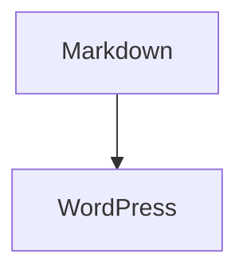

# 99blog-cli

把本地 Typora Markdown 发布到 WordPress。Markdown 是原稿；WordPress 是发布结果。

## 安装与配置

需要 Python 3.9+。可以直接从 GitHub 安装：

```sh
python -m pip install git+https://github.com/windows99-hue/99blog-cli.git
```

下载项目后，也可以在项目目录运行：

```sh
python -m pip install .
```

安装完成后可从任意目录运行 `99blog`，不需要一直停留在项目目录。参与开发时才需要用 `python -m pip install -e .`。

如果要把安装包复制到另一台电脑，可以在项目目录运行 `python -m pip wheel --no-deps . -w dist`，把生成的 `.whl` 文件复制过去，再运行 `python -m pip install 文件名.whl`。安装时仍需网络下载 Python 依赖。

然后在这台电脑上运行一次：

```sh
99blog configure
```

按提示输入自己的 WordPress 地址、用户名和应用密码。密码输入时不会显示；配置保存在当前用户的配置目录，不依赖项目目录。Windows 使用 `%APPDATA%\99blog-cli\config.env`，macOS 使用 `~/Library/Application Support/99blog-cli/config.env`，Linux 使用 `$XDG_CONFIG_HOME/99blog-cli/config.env`（未设置时为 `~/.config/99blog-cli/config.env`）。换电脑时重新安装 CLI 并各自运行一次 `99blog configure`。不需要在每篇文章旁边放 `.env`。

也可以把 `.env.example` 复制为 `.env`，填入 WordPress 用户名和应用密码：

```dotenv
WORDPRESS_URL=https://example.com/blog/
WORDPRESS_USERNAME=your-wordpress-username
WORDPRESS_APP_PASSWORD=your-application-password
```

`.env` 已加入 `.gitignore`。配置优先级为环境变量、当前目录 `.env`、用户配置、项目目录 `.env`。应用密码只保存在你自己的电脑上，不要把配置文件同步到公开仓库。

`WORDPRESS_URL` 填自己的 WordPress 站点地址，可安装在域名根目录或子目录。站点需要启用 HTTPS 和 REST API，并为用于发布的账户创建 **应用密码**。该账户还需要对应操作权限，例如发布文章、上传图片和创建分类。命令行工具依赖 WordPress 5.6+ 内置的应用密码认证，无需安装 WP-Editor.md 或 Kizumi 才能完成基础发布。

## 对其他 WordPress 站点的适配范围

创建或更新文章、分类和上传本地图片使用 WordPress 标准 REST API。普通 Markdown（标题、段落、列表、表格、链接、图片、代码块）会转成经过清理的 HTML，发布到 WordPress 的 HTML 区块。最终字体、颜色、代码高亮和间距由站点主题决定。

数学公式、Mermaid、Admonition 和 diff 的显示效果需要站点端配合。当前 `server/` 下的补丁是为 99blog 的 Kizumi 主题和 WP-Editor.md 环境编写的，不能直接保证在其他主题上获得相同外观；这些补丁也不会随着 `pip install` 自动部署到 WordPress。其他站点可先使用基础发布，再按自己的主题调整这些可选样式和脚本。详见 [server/README.md](server/README.md)。

## 发布

直接写普通 Markdown，例如 `posts/2026-09-26.md`：

````markdown
# 正文

Hello **World**.

```python
print("Hello")
```
````

执行：

```sh
99blog publish posts/2026-09-26.md
```

CLI 会询问标题、状态（`draft` 草稿或 `publish` 公开发布）和分类。按回车使用方括号中的默认值；没有 YAML 时，标题默认取文件名，状态默认为 `draft`，分类使用 WordPress 默认分类。多个分类用英文逗号隔开，例如 `技术, Python`。输入 `-` 可清除当前分类并回到 WordPress 默认分类。已有 YAML 中的值会作为默认值。每次发布都会询问，便于直接修改。

输入分类后，CLI 会先查询 WordPress：同名分类存在就复用，不存在就创建，然后将分类关联到文章。选定的分类名会保存在本地 YAML 的 `categories` 列表中。

第一次成功发布后，工具在本地 Markdown 顶部写入 YAML 元数据和 `wp_id`。以后运行相同命令就会更新原文章。**发送到 WordPress 的正文只包含 Markdown 正文转换出的 HTML，不包含 YAML。**原 Markdown 正文不会被改写。

要在另一台电脑继续修改同一篇文章，请在编辑前同步最新 Markdown 文件（包括顶部的 `wp_id` 和 `wp_media`）及其本地图片，发布后再把更新的 Markdown 同步回去。建议使用相对图片路径；写死某台电脑的绝对路径在别的电脑上通常找不到。各电脑的应用密码分别配置，不要放进文章文件。若另一台电脑拿到的是发布前、没有 `wp_id` 的旧稿，再发布会创建新文章；两台电脑同时编辑也可能互相覆盖内容。

预览执行内容而不访问 WordPress、不修改文件：

```sh
99blog publish posts/2026-09-26.md --dry-run
```

## 本地图片

Markdown 可以直接使用相对图片路径，例如：

```markdown

```

CLI 会从 Markdown 文件所在目录寻找图片，上传到 WordPress 媒体库，并将发送到 WordPress 的 HTML 图片地址替换为媒体库返回的 `source_url`。**本地 Markdown 中的图片路径保持原样。**远程图片地址不会上传。

成功发布后，本地 YAML 的 `wp_media` 会记录图片路径、内容哈希、媒体 ID 和 URL。同一张图片再次发布时复用已有媒体；图片内容变化后会重新上传。如果本地图片不存在，发布会在访问 WordPress 前停止。`--dry-run` 只检查图片，不上传。

## 数学公式

支持 Typora 常用的行内与独立公式写法：

````markdown
行内公式：$E=mc^2$，也支持 \(E=mc^2\)。

$$
\frac{a}{b}
$$

也支持独立的 \[ ... \] 公式块。
````

CLI 会在 Markdown 转换时保护公式，并输出博客现有 KaTeX 脚本识别的 HTML。公式不再依赖 WordPress 猜测 `$` 的位置；代码块和行内代码中的美元符号仍保持原样。KaTeX 支持大量 LaTeX 数学命令，但不等同于完整 LaTeX 排版系统；不支持的命令会由博客端 KaTeX 报错。

## Mermaid 图表

在 Markdown 中使用 `mermaid` 代码块，例如：

````markdown

````

CLI 会保留图表源码；博客上的 `server/99blog-mermaid.php` 使用本地托管的 Mermaid 11.17.2 将其渲染为 SVG。支持 Mermaid 的流程图、时序图、类图、饼图等语法。渲染使用严格安全模式；语法错误时应先检查代码块内的 Mermaid 文本。

## Admonition 提示框

支持 MkDocs 风格的 `!!!` 和 GitHub 风格的引用提示框。`!!!` 下的正文要缩进四个空格：

```markdown
!!! note "自定义标题"
    这里可以写 **Markdown**。

> [!WARNING]
> 这是一条警告。
```

常用类型包括 `note`、`tip`、`important`、`warning`、`caution` 和 `danger`。博客端的 `server/99blog-admonitions.php` 为提示框提供样式。

## Diff 代码块

用 `diff` 或 `patch` 语言标记代码围栏，博客会按行标出新增、删除、文件头和修改区块，并显示行号。代码内容仍可直接选择、复制。

````markdown
```diff
-old value
+new value
```
````

## HTML 安全

发布前会清理正文 HTML，只保留常见 Markdown 标签、`details` 折叠区、`kbd` 按键以及安全的链接和图片地址。`div` 的行内样式仅允许 `padding` 和 `border`；脚本、事件属性和 `javascript:` 链接不会作为可执行 HTML 发布。要在 HTML 容器内解析 Markdown，可在开始标签加 `markdown="1"`，例如 `<details markdown="1">`。代码块中的示例仍显示为文本。CLI 使用 WordPress 的 HTML 区块保存转换结果，避免 WP-Editor.md 对 HTML 再做一次 Markdown 转换。博客服务器还部署了 `server/99blog-content-safety.php`，在显示旧文章时过滤危险标签。原始 Markdown 文件保持不变。

也可以用 `python main.py publish posts/2026-09-26.md`。已有的 `tags` 会保存在本地 YAML 中，但暂不发送到 WordPress。

如果 WordPress 已接受文章而本地文件回写失败，CLI 会显示文章 ID。重试前请手动把该 ID 写入本地 YAML 的 `wp_id`，避免创建重复文章。

## 许可证

项目代码采用 [MIT 许可证](LICENSE)。随项目提供的 Mermaid 构建文件保留了自己的 [MIT 许可证文本](server/assets/mermaid-11.17.2-LICENSE)。
